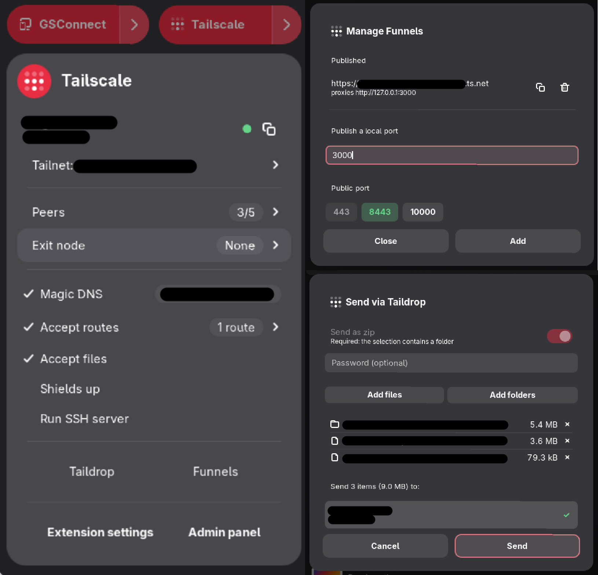

<!-- markdownlint-disable MD033 MD041 -->
[](https://extensions.gnome.org/extension/10017/tailscale/)
[](https://release.gnome.org/)
[](https://github.com/Disk-MTH/Tailscale-Gnome/releases/latest)
[](./LICENSE)
[](./po)

# Tailscale for GNOME

<a href="https://extensions.gnome.org/extension/10017/tailscale/"></a>

**The complete Tailscale VPN client for the GNOME Shell Quick Settings.**
Connect, switch accounts, manage exit nodes, publish services with Funnel, and
send or receive files with Taildrop, all without leaving the panel or opening a
terminal. Built for GNOME Shell 49 and 50, on Wayland and Xorg.

<br>

<p align="center">
  <a href="https://extensions.gnome.org/extension/10017/tailscale/"></a>
  <br>
  <sub><b>Left:</b> the Quick Settings menu, peers, exit node, Magic DNS, accepted routes, and the Taildrop and Funnel entry points. &nbsp;·&nbsp; <b>Top right:</b> the Funnel manager. &nbsp;·&nbsp; <b>Bottom right:</b> the Taildrop send dialog.</sub>
</p>

> **Note on development.** This extension was built based on functional specs and requirements, with AI assistance used for code generation and iterative refinement.
> While the code is tested and reliable for daily use, you might still encounter edge cases.
> Bug reports and contributions are very welcome!

> **Trademark notice.** This project is an independent, community-built
> extension. It is **not affiliated with, sponsored by, or endorsed by
> Tailscale Inc.** "Tailscale" is a trademark of Tailscale Inc., used
> here in a purely nominative sense to describe what the extension
> integrates with.

## Features

| Feature | What it does |
| ------- | ------------- |
| **Connect** | One-click connect / disconnect and account switching, with a panel icon next to Wi-Fi while connected. |
| **Exit nodes** | Pick None, Auto, or any peer, with a status pill and a panel warning if the selected node stops routing. |
| **Funnel** | Publish, copy, and remove exposed services from a single dialog. |
| **Taildrop** | Send and receive files with peers, plus a "Send with Taildrop" entry in Nautilus. |
| **Menu toggles** | Magic DNS, accepted routes, Shields up, SSH server, and LAN access, one tap away. |
| **Shortcuts** | Bind your own keys for connect, exit node, menu, admin console, Taildrop, and Funnels. |

## Compared to the other Tailscale GNOME extensions

Three other Tailscale extensions exist for GNOME Shell, and they are good at
what they do. This table is what each one actually ships, read from their
source, not from their README, in August 2026. Where they are ahead, the table
says so.

| | **Tailscale for GNOME**<br>(this one) | [Tailscale QS](https://extensions.gnome.org/extension/9193/tailscale-qs/) | [Tailscale Status](https://extensions.gnome.org/extension/5112/tailscale-status/) | [Tailscale Connect](https://extensions.gnome.org/extension/6843/tailscale-connect/) |
| --- | :---: | :---: | :---: | :---: |
| GNOME Shell versions | 49 – 50 | 45 – 50 | 45 – 50 | 42 – 43 |
| Last upstream commit | 2026 | 2026 | 2026 | 2024 |
| Lives in | Quick Settings | Quick Settings | Top-bar menu | Top-bar menu |
| Connect / disconnect | ✅ | ✅ | ✅ | ✅ |
| Login / logout from the menu | ✅ | ❌ | ✅ | ✅ |
| Multi-account switching | ✅ | ✅ | ✅ | ❌ |
| Exit nodes | ✅ None / Auto / peer | ✅ + Mullvad flags | ✅ | ✅ |
| Warns when the exit node stops routing | ✅ | ❌ | ❌ | ❌ |
| Peer list with copy address | ✅ IP or Magic DNS | ✅ IP | ✅ IP | ❌ |
| Magic DNS toggle | ✅ | ✅ | ❌ | ❌ |
| Accept routes / Shields up / LAN access | ✅ | ✅ | ✅ | ✅ |
| SSH server toggle | ✅ | ✅ | ❌ | ✅ |
| **Taildrop send** | ✅ portal picker, folders, zip | ❌ | ✅ needs `zenity` | ❌ |
| **Taildrop receive** | ✅ auto, click to reveal | ❌ | ✅ manual, one shot | ❌ |
| **File-manager integration** | ✅ Nautilus "Send with Taildrop" | ❌ | ❌ | ❌ |
| **Funnel management** | ✅ publish, copy, remove | ❌ | ❌ | ❌ |
| Preferences window | ✅ 4 pages | ❌ none | ✅ 1 setting | ✅ |
| Notifications | ✅ 9 configurable categories | ❌ none | fixed | fixed |
| Keyboard shortcuts | ✅ 6 bindable | ❌ | ❌ | ❌ |
| Shipped translations | ✅ FR · DE · IT | ❌ | ❌ | ❌ |
| Degrades gracefully with no `tailscale` | ✅ | ❌ | ❌ | ❌ |
| Custom login server ([Headscale](https://github.com/juanfont/headscale)) | ❌ *(soon…)* | ❌ | ✅ | ✅ |
| Mullvad exit nodes with country flags | ❌ *(soon…)* | ✅ | ❌ | ❌ |
| License | GPL-2.0-or-later | GPL-3.0 | GPL-2.0 | GPL-3.0 |

## Requirements

- GNOME Shell 49 → 50.
- `tailscale` 1.70+ on `PATH`.
- `pkexec` (polkit) for the privileged calls listed below.

File pickers use the XDG Desktop Portal (`org.freedesktop.portal.FileChooser`), which ships with every GNOME session, no external
dialog tool is spawned.

Nautilus integration (off by default) needs the `nautilus-python`
package. Without it, the file manager loads no Python extension at
all, and preferences grey the toggle out and say so.

With no `tailscale` on `PATH`, or with the `tailscaled` daemon not
answering, the extension goes inert rather than broken. The panel button
stays but loses its arrow: there is nothing behind it that could run, so
clicking it opens the preferences window instead of opening onto
controls that would all be refused. That window is reduced to its Help
page, which names which of the two states this is and the command that
fixes it. The keybinding that opens the menu lands there too; the ones
aimed at an action, and the Nautilus entry, refuse with a notification
instead. Nothing is ever spawned. It keeps polling from there (at a
slow tick while the binary is missing), so installing the package or
starting the service brings the menu and the other preference pages back
on their own. No reload, no logout.

## Privileged operations

On Linux the Tailscale daemon only accepts state-changing commands from
root or from the Unix user named in its `OperatorUser` pref. The
extension therefore runs a **small, fixed set** of commands through
`pkexec`, each behind an interactive polkit password prompt:

| Command | When it runs |
| ------- | ------------ |
| `pkexec tailscale set --operator=$USER` | Once at login if the operator pref is missing, and when you click **Set operator**. Makes every later command work without a prompt. |
| `pkexec tailscale login --operator=$USER` | When you click **Login**. Tailscale refuses a plain login on operator-set profiles, so this keeps the operator pref on the new profile too. |
| `pkexec tailscale logout` | When you click **Logout**. One prompt only; the next **Login** restores the operator pref on its own. |
| `pkexec tailscale switch <profile-id>` | When you switch accounts without an operator set, typically right after a logout. |

Safeguards:

- Every elevated command is a **literal argument vector**, readable
  as-is in the source; nothing typed by a user, read from a file or
  built at runtime is ever concatenated into it (no `sh -c`).
- The program name is always the bare `tailscale`, resolved on `PATH`
  (in `pkexec`'s own trusted root `PATH` for elevated calls). No setting
  can point it elsewhere, so a user-writable path is never run, let
  alone elevated.

## Clipboard access

The extension **writes** to the clipboard and never reads from it. Every
write is a direct answer to a click on a copy button, and puts exactly
what that button sits next to on the clipboard:

| Button | What it copies |
| ------ | -------------- |
| Copy, on the device row or a peer row | That device's Tailscale IP, or its Magic DNS name when Magic DNS is on |
| Copy address, on a Funnel row | The public `https://…` URL that funnel serves |
| Copy, in preferences → Help | The four version lines shown above it, for a bug report |

Nothing is copied in the background, none of it leaves the machine, and
no keyboard shortcut ships bound: every shortcut defaults to unset, and
none of the six touch the clipboard at all.

## Install

```bash
git clone https://github.com/Disk-MTH/Tailscale-Gnome.git
cd Tailscale-Gnome
make install
# Wayland: log out, log back in.
# Xorg:    Alt+F2, type r, Enter.
gnome-extensions enable tailscale-gnome@diskmth.fr
```

Pack a release zip with `make pack`.

## Settings

Open with `gnome-extensions prefs tailscale-gnome@diskmth.fr` or click
**Extension settings** in the menu.

| Page          | Setting                            | Default       |
| ------------- | ---------------------------------- | ------------- |
| General       | Show panel indicator               | on            |
| General       | Exit node indicator: connected (icon / colour) | on / theme |
| General       | Exit node indicator: disconnected (icon / colour) | on / `#e6b800` |
| General       | Taildrop inbox folder              | `~/Downloads/Taildrop` |
| General       | Nautilus integration               | off           |
| General       | Poll interval                      | 3s            |
| Notifications | Minimum pending duration           | 1000ms        |
| Notifications | Per-category reporting (nine of them, All / Errors / Off) | all |
| Shortcuts     | Connect / disconnect               | unbound       |
| Shortcuts     | Toggle automatic exit node         | unbound       |
| Shortcuts     | Open the Tailscale menu            | unbound       |
| Shortcuts     | Open the admin console             | unbound       |
| Shortcuts     | Open Taildrop                      | unbound       |
| Shortcuts     | Open Funnels                       | unbound       |
| Help          | Availability: Taildrop / Funnel    | read from every poll |
| Help          | Versions, source and issue links   | read-only     |

## Debugging

```bash
# Live extension logs
journalctl --user -f /usr/bin/gnome-shell | grep -iE 'tailscale|extension'

# What the UI sees
tailscale status --json | jq .
tailscale debug prefs   | jq .
```

Looking Glass (`Alt+F2`, type `lg`) lists errors thrown since the shell
started.

## Project layout

The two processes are kept apart on disk: `lib/` is loaded only by GNOME
Shell, `prefs/` only by the preferences window, and `lib/util.js` and
`lib/notify-policy.js` are the sole modules both may import, so neither
pulls in the other's toolkit.

```
extension.js            # entry point: lifecycle, shortcuts, D-Bus
prefs.js                # preferences entry point, one page per file below
lib/                    # GNOME Shell process
├── tailscale.js        # CLI wrapper + poller
├── indicator.js        # panel icon
├── menu.js             # Quick Settings toggle
├── menu/
│   ├── rows.js         # the rows every submenu is built from
│   ├── send-dialog.js  # Taildrop send flow + archiving
│   └── funnels-dialog.js
├── watchers.js         # snapshot diffing into semantic events
├── watcher-messages.js # those events, turned into translated wording
├── quiet-window.js     # the silence held open around an account switch
├── notify-policy.js    # category, level and quiet-window rules
├── notify.js           # notification entry point
├── tray.js             # notification backend (MessageTray.Source)
├── nautilus.js         # symlinks the file-manager extension in and out
└── util.js             # helpers shared by shell and prefs processes
prefs/                  # preferences process
├── common.js           # settings watcher, reset button, not-installed group
├── general.js  taildrop.js  notifications.js  shortcuts.js  help.js
nautilus/               # the nautilus-python extension itself
icons/  schemas/  stylesheet.css
```

## FAQ

### Does it work on Wayland?

Yes, on Wayland and on Xorg alike. It is a GNOME Shell extension, so it runs
inside the shell process in both sessions. Only the reload step after install
differs: Wayland needs a log out and back in, Xorg accepts `Alt+F2`, `r`.

### Which GNOME Shell versions are supported?

GNOME Shell 49 and 50. Older shells are not supported: GNOME 45 through 48
would need the extension to be ported back, and the extension declares only
what it is tested against, so `gnome-extensions` refuses to load it elsewhere
rather than half-working.

### Do I need root or `sudo` to use it?

Only once. The Tailscale daemon accepts state-changing commands from root or
from the user named in its `OperatorUser` pref, so the extension asks polkit
once to set you as operator; after that, connecting, exit nodes, Taildrop and
Funnel run with no prompt at all. The full list of elevated commands is in
[Privileged operations](#privileged-operations) above, four of them, each a
literal argument vector.

### Does it work with Headscale or another custom login server?

Not yet, but it is planned. There is no login-server setting today, so a
self-hosted [Headscale](https://github.com/juanfont/headscale) control plane is
out of reach for now.

### Does it read my clipboard, or send anything anywhere?

No. It **writes** to the clipboard and never reads from it, only when you click
a copy button, and only the address or Funnel URL that button sits next to. No
telemetry, no network call of its own: every piece of data on screen comes from
the local `tailscale` CLI. See [Clipboard access](#clipboard-access).

### Is this the official Tailscale app?

No. This is an independent, community-built GNOME Shell extension, not
affiliated with, sponsored by, or endorsed by Tailscale Inc. It drives the
official `tailscale` CLI that you install yourself; it does not replace it or
bundle it.

## License

GPL-2.0-or-later, see [LICENSE](./LICENSE), the same terms GNOME Shell
itself is published under.
